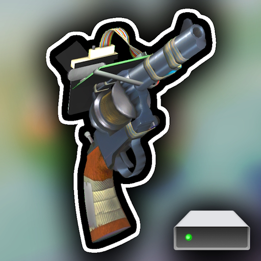

#  Fix Server Constraints Limit
Fix constraint limits for your dedicated Garry's Mod server.

>   

>     
>  
> 

Can't use ropes or welds on your dedicated server? Don't worry! This addon fixes that, and makes it easy to manage!

> [!TIP]
> *This addon has settings you can utilize to customize your experience.*

---

## About

When you host a dedicated Garry's Mod server, chances are you won't be able to create welds or ropes because of the non-existent constraint limit values, essentially prohibiting all constraints.

If you're hosting a dedicated server to play with friends and need to use welds and ropes, but can't - this addon is for you! Add it to your collection, and enjoy welding and roping!

This addon simply adds the missing ConVars needed to define weld and rope limits.

---

### Configuration
###### Change options in the addon

If you're an admin, you can find configurations in the spawnmenu in `Utilities` > `Admin` > `Fix Constraint Limits`. You may change the constraint and rope constraint limits. You can also find a button to reset all values to default. If you're a superadmin, you can find an option in `Options` > `Constraints` > `Admin` to restrict the ability to modify these limits strictly to superadmins, from regular admins.

If you're the server operator, you can also type the following variables as commands in the console to modify them.

|           Variable            | About                                   | Default |
| :---------------------------: | --------------------------------------- | :-----: |
|   **`sbox_maxconstraints`**   | Maximum weld limit                      | `2000`  |
| **`sbox_maxropeconstraints`** | Maximum rope limit                      | `1000`  |
|       `fsc_superadmin`        | Only allow superadmins to change limits |   `1`   |

Format: `variable_name {number}`