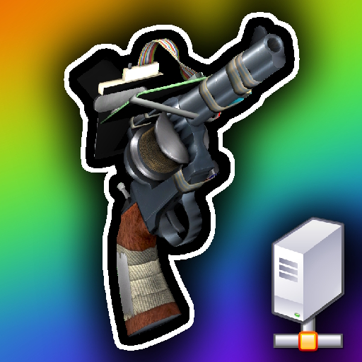

#  Fix Server Constraints Limit
Fix constraint limits for your dedicated Garry's Mod server.

>     
>  
> 

Can't use ropes or welds on your dedicated server? Don't worry! This addon simply fixes that!

---

## About

When you host a dedicated Garry's Mod server, chances are you won't be able to create welds or ropes because of the non-existent constraint limit values, essentially prohibiting all constraints.

If you're hosting a dedicated server to play with friends and need to use welds and ropes, but can't - this addon is for you! Add it to your collection, and enjoy welding and roping!

This addon simply adds the missing ConVars needed to define weld and rope limits.